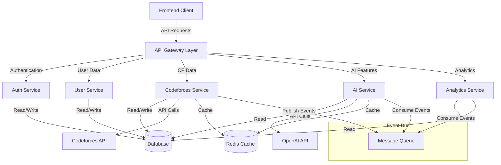

# CFviz Architecture Design

## System Overview

CFviz is an AI-enhanced competitive programming dashboard that helps users visualize and improve their Codeforces performance through data analysis and AI-powered recommendations.

This document outlines a scalable, secure, and maintainable architecture for the CFviz platform, designed to handle increasing user loads while providing reliable AI features and data analysis.

## Architecture Diagram



## Core Services

### 1. API Gateway Layer

Acts as the entry point for all client requests, handling routing, request validation, rate limiting, and API versioning.

**Key Responsibilities:**
- Route requests to appropriate microservices
- Validate API request formats
- Apply rate limiting to prevent abuse
- Handle CORS and basic security measures
- Implement API versioning

### 2. Authentication Service

Manages user authentication, authorization, and security.

**Key Responsibilities:**
- User registration and login
- JWT token issuance and validation
- Password hashing and security
- Session management
- Role-based access control

### 3. User Service

Handles user profile data and preferences.

**Key Responsibilities:**
- User profile management
- Preference settings
- Codeforces handle association
- User data retrieval and updates

### 4. Codeforces Service

Interfaces with the Codeforces API to fetch and process competitive programming data.

**Key Responsibilities:**
- Fetch user submissions, contests, and problems
- Process and normalize Codeforces data
- Implement smart caching to reduce API calls
- Handle Codeforces API rate limits and outages
- Emit events for significant data updates

### 5. AI Service

Provides AI-powered features using machine learning and NLP.

**Key Responsibilities:**
- Generate personalized problem recommendations
- Analyze user performance patterns
- Predict contest outcomes
- Provide AI coding assistance
- Process and learn from user feedback

### 6. Analytics Service

Analyzes user performance data and generates insights.

**Key Responsibilities:**
- Calculate performance metrics by problem tags
- Generate strength/weakness analyses
- Track progress over time
- Create visualization-ready data structures

## Data Architecture

### Database Schema

The core database uses PostgreSQL with the following main entities:

#### User
- Basic account information (email, password hash, etc.)
- Preferences and settings
- Codeforces handle

#### Problem
- Problem metadata (ID, name, tags, rating)
- Aggregated statistics

#### UserSolution
- User's problem submissions
- Performance metrics per submission

#### Recommendation
- AI-generated recommendations
- Reason codes and explanations

#### PerformanceMetric
- User performance by category/tag
- Strength scores and analytics

#### ContestPrediction
- Predictions for upcoming contests
- Preparation advice

### Caching Strategy

A Redis cache is implemented with:

1. **Tiered Caching:**
   - L1: In-memory cache for high-frequency data
   - L2: Redis for distributed caching
   
2. **Cache Policies:**
   - Codeforces profile data: 1-hour TTL
   - Problem set data: 24-hour TTL
   - User submissions: 15-minute TTL
   - AI recommendations: 24-hour TTL

3. **Cache Invalidation:**
   - Event-based invalidation for user-specific data
   - Time-based expiration for external data
   - Forced invalidation for critical updates

## API Contracts

### Authentication API

#### Register User
```
POST /api/v1/auth/register
Content-Type: application/json

{
  "email": "string",
  "password": "string",
  "handle": "string"
}

Response: 201 Created
{
  "userId": "integer",
  "token": "string"
}
```

#### Login User
```
POST /api/v1/auth/login
Content-Type: application/json

{
  "email": "string",
  "password": "string"
}

Response: 200 OK
{
  "userId": "integer",
  "token": "string"
}
```

### User API

#### Get User Profile
```
GET /api/v1/users/profile
Authorization: Bearer {token}

Response: 200 OK
{
  "id": "integer",
  "email": "string",
  "handle": "string",
  "createdAt": "datetime"
}
```

#### Update User Profile
```
PUT /api/v1/users/profile
Authorization: Bearer {token}
Content-Type: application/json

{
  "handle": "string",
  "email": "string"
}

Response: 200 OK
{
  "id": "integer",
  "email": "string",
  "handle": "string",
  "updatedAt": "datetime"
}
```

### Codeforces API

#### Get User Stats
```
GET /api/v1/codeforces/user/{handle}
Authorization: Bearer {token}

Response: 200 OK
{
  "userInfo": {
    "handle": "string",
    "rank": "string",
    "rating": "integer",
    "maxRating": "integer",
    "avatar": "string"
  },
  "tagRatings": [
    {
      "tag": "string",
      "solved": "integer",
      "attempted": "integer",
      "successRate": "float"
    }
  ]
}
```

#### Get User Submissions
```
GET /api/v1/codeforces/submissions/{handle}
Authorization: Bearer {token}
Query Parameters:
  count: integer (default: 100)
  page: integer (default: 1)

Response: 200 OK
{
  "submissions": [
    {
      "id": "string",
      "contestId": "integer",
      "problem": {
        "name": "string",
        "index": "string",
        "tags": ["string"]
      },
      "verdict": "string",
      "creationTimeSeconds": "integer"
    }
  ],
  "pagination": {
    "total": "integer",
    "page": "integer",
    "pageSize": "integer",
    "totalPages": "integer"
  }
}
```

### AI API

#### Get Problem Recommendations
```
GET /api/v1/ai/recommendations
Authorization: Bearer {token}
Query Parameters:
  limit: integer (default: 5)

Response: 200 OK
{
  "recommendations": [
    {
      "problemId": "string",
      "name": "string",
      "tags": ["string"],
      "difficulty": "string",
      "url": "string",
      "reason": "string"
    }
  ]
}
```

#### Get Performance Analysis
```
GET /api/v1/ai/performance-analysis
Authorization: Bearer {token}

Response: 200 OK
{
  "strengths": [
    {
      "tag": "string",
      "score": "float",
      "solved": "integer",
      "attempted": "integer"
    }
  ],
  "weaknesses": [
    {
      "tag": "string",
      "score": "float",
      "solved": "integer",
      "attempted": "integer"
    }
  ],
  "recentProgress": {
    "improvementRate": "float",
    "topImprovedTags": ["string"]
  }
}
```

#### Get Contest Predictions
```
GET /api/v1/ai/contest-predictions
Authorization: Bearer {token}

Response: 200 OK
{
  "predictions": [
    {
      "contestId": "integer",
      "contestName": "string",
      "startTime": "datetime",
      "predictedRank": "integer",
      "predictedRatingChange": "integer",
      "confidence": "float",
      "preparationAdvice": "string"
    }
  ]
}
```

#### AI Assistant Chat
```
POST /api/v1/ai/assistant/chat
Authorization: Bearer {token}
Content-Type: application/json

{
  "message": "string",
  "context": {
    "problemId": "string (optional)",
    "code": "string (optional)"
  }
}

Response: 200 OK
{
  "response": "string",
  "followupQuestions": ["string"]
}
```

## Security Architecture

### Authentication Flow

1. **User Registration:**
   - Email and password validation
   - Password hashing with Argon2id
   - JWT token generation with limited lifespan
   
2. **Authentication:**
   - JWT validation middleware
   - Role-based access control
   - Token refresh mechanism

### Data Protection

1. **Data at Rest:**
   - Database encryption for sensitive fields
   - Regular backups with encryption
   
2. **Data in Transit:**
   - TLS encryption for all API traffic
   - Secure cookie handling

3. **API Security:**
   - Input validation and sanitization
   - Rate limiting to prevent abuse
   - CORS configuration

### API Key Management

1. **Third-party API Keys:**
   - Environment variable encryption
   - Key rotation policy
   - Access auditing

## Scalability Design

### Horizontal Scaling

1. **Stateless Services:**
   - All services designed to be stateless
   - Session data stored in Redis
   
2. **Database Scaling:**
   - Read replicas for heavy read operations
   - Connection pooling
   - Query optimization

### Performance Optimization

1. **Caching Strategy:**
   - Multi-level caching
   - Cache warming for popular data
   - Cache invalidation policies
   
2. **Background Processing:**
   - Offloading intensive operations to background jobs
   - Asynchronous processing of AI recommendations
   - Event-driven architecture for data updates

## Event-Driven Architecture

### Message Queue Implementation

Using a message queue system (RabbitMQ or AWS SQS) for:

1. **Event Types:**
   - UserProfileUpdated
   - NewSubmissionsDetected
   - RecommendationsGenerated
   - AnalysisCompleted

2. **Event Handlers:**
   - Update cache on profile changes
   - Trigger AI analysis on new submissions
   - Generate notifications for important events

## Observability

### Logging

1. **Structured Logging:**
   - Request ID tracking across services
   - Error level differentiation
   - Context-aware logging

### Metrics

1. **Service Metrics:**
   - Request latency and throughput
   - Error rates and types
   - Resource utilization

2. **Business Metrics:**
   - User engagement metrics
   - AI recommendation effectiveness
   - Feature usage statistics

### Alerting

1. **Alert Conditions:**
   - Service availability issues
   - Elevated error rates
   - Performance degradation
   - API quota usage thresholds

## Deployment Architecture

### CI/CD Pipeline

1. **Continuous Integration:**
   - Automated testing
   - Static code analysis
   - Security scanning

2. **Deployment Strategy:**
   - Blue-green deployments
   - Canary releases for AI features
   - Rollback capabilities

### Infrastructure as Code

Infrastructure defined and managed as code using tools like Terraform or CloudFormation.

## Development Standards

### Code Organization

```
/src
  /api
    /v1
      /auth
      /users
      /codeforces
      /ai
      /analytics
  /config
  /controllers
  /middleware
  /models
  /services
    /auth
    /user
    /codeforces
    /ai
    /analytics
  /utils
  /events
  /caching
  /tests
```

### Coding Standards

1. **Naming Conventions:**
   - Camel case for variables and functions
   - Pascal case for classes and interfaces
   - Meaningful, descriptive names
   
2. **Documentation:**
   - JSDoc comments for functions and classes
   - README files for services and modules
   - API documentation with OpenAPI/Swagger

3. **Error Handling:**
   - Consistent error responses
   - Detailed logging
   - Graceful degradation

## Monitoring and Maintenance

### Health Checks

Each service exposes a health check endpoint:
```
GET /health
Response: 200 OK
{
  "status": "healthy",
  "version": "1.0.0",
  "dependencies": {
    "database": "healthy",
    "redis": "healthy",
    "openai": "healthy"
  }
}
```

### Service Metrics

Each service collects and exposes performance metrics:
```
GET /metrics
Response: 200 OK
{
  "requestCount": "integer",
  "errorRate": "float",
  "averageResponseTime": "float",
  "p95ResponseTime": "float",
  "resourceUtilization": "float"
}
```

## Conclusion

The proposed architecture provides a scalable, secure, and maintainable foundation for the CFviz platform. By adopting microservices, event-driven design, and robust security practices, the system can handle growing user demand while maintaining high performance and reliability.

The architecture emphasizes:
- Clear service boundaries with well-defined APIs
- Comprehensive security measures
- Scalability through horizontal scaling and caching
- Observability for monitoring and troubleshooting
- Maintainability through consistent standards and documentation

This design will support the continued growth and evolution of the CFviz platform while ensuring a high-quality experience for competitive programmers using the system.